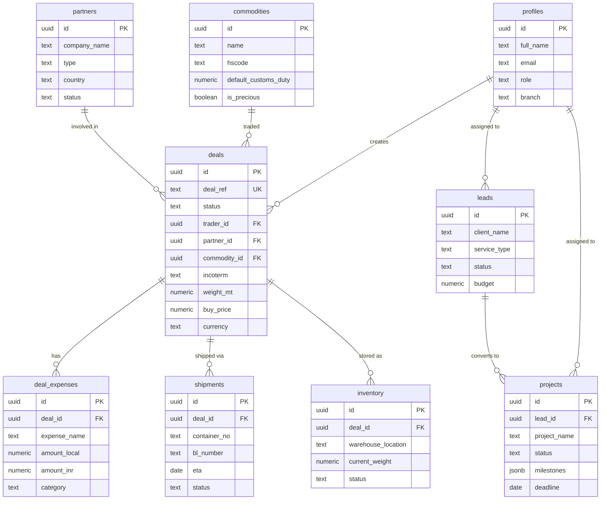

# 🗄️ GVG Global Group - Database Documentation

## Entity Relationship Diagram (ERD)



## Table Details

### 📊 Profiles
**Purpose**: User authentication and authorization
- Auto-created when user signs up
- Role determines access permissions
- Branch for geographic organization

**Key Fields**:
- `role`: Admin | Trader | Consultant | Viewer
- `branch`: Halifax | India | Dubai

---

### 🏭 Commodities
**Purpose**: Master list of tradeable metals
- Precious metals flagged separately
- HS codes for customs
- Default duty rates

**Sample Data**:
- Copper Millberry (HS: 740311)
- Gold Bars (HS: 710812, precious)
- Aluminum Ingots (HS: 760110)

---

### 🤝 Partners
**Purpose**: Suppliers, customers, and both
- Status: Active | Blacklist | Inactive
- Type: Supplier | Customer | Both
- Full contact details

---

### 💰 Cost Heads
**Purpose**: Standard expense categories
- `is_fixed`: true for flat fees, false for variable
- Default values as starting point
- Category grouping for reporting

---

### 📈 Deals
**Purpose**: Core metal trading transactions
- Unique deal_ref per transaction
- Complete trade details (incoterm, pricing, logistics)
- Status workflow: Draft → Approved → Shipped → Customs → Stock → Sold

**Business Logic**:
- `weight_mt` must be > 0
- `buy_price` must be > 0
- `exchange_rate_locked` stores rate at deal creation
- Cascading deletes for related expenses/shipments

---

### 💸 Deal Expenses
**Purpose**: Track all costs associated with a deal
- `amount_local`: in deal currency
- `amount_inr`: converted to INR for reporting
- Categories: Freight | Duty | Bank | Handling | Insurance

**Calculation Flow**:
1. Import expense in local currency
2. Apply exchange rate
3. Store INR equivalent
4. Sum for total deal cost

---

### 🚢 Shipments
**Purpose**: Container and shipping tracking
- BL (Bill of Lading) number
- ETA (Estimated) and ATA (Actual) arrival dates
- Port details
- Status: Booked → In Transit → Arrived → Cleared → Delivered

---

### 📦 Inventory
**Purpose**: Warehouse stock management
- `current_weight`: total available
- `reserved_weight`: allocated but not sold
- Multi-warehouse support
- Status: Available | Reserved | Sold | In Transit | Damaged

---

### 🎯 Leads
**Purpose**: IT services sales pipeline
- Service types: Web | App | QA | Cloud | Consulting | Custom
- Status funnel: New → Contacted → Qualified → Proposal → Negotiation → Won/Lost
- Budget tracking

---

### 💻 Projects
**Purpose**: IT project management
- Linked to originating lead
- `milestones`: JSONB array of project phases
- Progress tracking (0-100%)
- Budget vs actual cost monitoring

**Milestone Structure**:
```json
{
  "id": "milestone-1",
  "title": "Requirements Gathering",
  "description": "Collect and document requirements",
  "deadline": "2024-03-15",
  "completed": false
}
```

---

## 🔐 Row Level Security (RLS) Policies

### Admin Role
- **Full Access**: Can read, insert, update, delete all tables
- No restrictions

### Trader Role
- **Deals**: Full CRUD on own deals, read all
- **Partners**: Full CRUD
- **Commodities**: Full CRUD
- **Cost Heads**: Read only
- **Shipments**: Full CRUD
- **Inventory**: Full CRUD
- **Leads/Projects**: Read only

### Consultant Role
- **Leads**: Full CRUD
- **Projects**: Full CRUD
- **Deals**: Read approved only
- **Partners**: Read only
- **Others**: Read only

### Viewer Role
- **All Tables**: Read approved/public data only
- Cannot create, update, or delete

---

## 🔄 Automated Triggers

### 1. Updated_at Timestamp
- **Tables**: All tables with `updated_at` field
- **Trigger**: Automatically sets `updated_at = NOW()` on every UPDATE

### 2. Auto-create Profile
- **Table**: auth.users
- **Trigger**: When new user signs up, creates matching profile record
- **Default Role**: Viewer (upgrade manually)
- **Default Branch**: Halifax

---

## 📈 Indexes for Performance

### Primary Indexes
- All primary keys (id) are auto-indexed
- Unique constraints on: `deal_ref`, `email`, `commodity.name`, `cost_head.name`

### Query Optimization Indexes
- `deals(status, trader_id, partner_id, created_at)`
- `profiles(role, branch, email)`
- `inventory(status, warehouse_location)`
- `leads(status, service_type)`
- `projects(status, deadline)`

---

## 🧪 Example Workflows

### Creating a Metal Deal
```typescript
1. Create deal record
   ├─ Select commodity
   ├─ Select partner (supplier)
   ├─ Set trade terms (incoterm)
   └─ Lock exchange rate

2. Add expenses
   ├─ Ocean freight
   ├─ Customs duty
   └─ Bank charges

3. Create shipment
   ├─ Container details
   ├─ BL number
   └─ ETA date

4. Update deal status: Draft → Approved → Shipped

5. On arrival: Customs clearance
   └─ Update status: Shipped → Customs → Stock

6. Add to inventory
   ├─ Warehouse location
   ├─ Available weight
   └─ Status: Available

7. On sale: Update inventory status to Sold
```

### Managing IT Project
```typescript
1. Create lead
   ├─ Client details
   ├─ Service type
   └─ Estimated budget

2. Qualify lead: New → Contacted → Qualified

3. Convert to project
   ├─ Link lead_id
   ├─ Define milestones
   ├─ Set deadline
   └─ Assign consultant

4. Track progress
   ├─ Update milestone completion
   ├─ Update progress %
   └─ Track actual vs budgeted cost

5. Complete: Status → Completed
```

---

## 🎨 Data Integrity Constraints

### Check Constraints
- `weight_mt > 0`
- `buy_price > 0`
- `reserved_weight <= current_weight`
- `progress_percentage BETWEEN 0 AND 100`

### Enum Constraints
All status fields, types, and categories use CHECK constraints to enforce valid values

### Foreign Key Constraints
- Cascade delete: expenses, shipments when deal deleted
- Restrict delete: cannot delete partner if deals exist

---

## 📊 Reporting Queries

### Total Deal Value by Status
```sql
SELECT 
  status,
  COUNT(*) as deal_count,
  SUM(weight_mt * buy_price) as total_value,
  AVG(buy_price) as avg_price_per_mt
FROM deals
GROUP BY status;
```

### Inventory Turnover
```sql
SELECT 
  warehouse_location,
  SUM(CASE WHEN status = 'Available' THEN current_weight ELSE 0 END) as available,
  SUM(CASE WHEN status = 'Reserved' THEN current_weight ELSE 0 END) as reserved,
  SUM(CASE WHEN status = 'Sold' THEN current_weight ELSE 0 END) as sold
FROM inventory
GROUP BY warehouse_location;
```

### Project Win Rate
```sql
SELECT 
  COUNT(CASE WHEN status = 'Won' THEN 1 END)::float / 
  NULLIF(COUNT(CASE WHEN status IN ('Won', 'Lost') THEN 1 END), 0) * 100 as win_rate_percentage
FROM leads;
```

---

**Database Schema Version**: 1.0  
**Last Updated**: 2024  
**Maintained By**: GVG Global Group Tech Team
